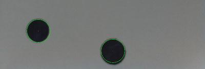

# Curso Raspberry Pi Basico

## CEP Priego-Montilla

Abril-Mayo 2018

## José Antonio Vacas  @javacasm

## [https://github.com/javacasm/RaspberryPriego](https://github.com/javacasm/RaspberryPriego)

# Python y la cámara: openCV

Vamos a ver cómo utilizar librerías de reconocimiento de objetos para detectar formas y colores en imágenes provenientes de la cámara

[vídeo](https://www.youtube.com/watch?v=CigGvt3DXIw)

Usaremos la librería OpenCV, librería desarrollada para trabajar en sistemas de
reconocimiento de imágenes.

Es una de las más utilizadas
Funcionar independientemente de la fuente de las imágenes, (tiempo real o imágenes almacenadas)

Un proyecto sencillo: detectar la posición de unos círculos en la imagen.

(Deteccion de una pelota en el suelo. Basta con que sepamos “restar” el fondo a nuestra
imagen)

Instalamos

	 sudo apt-get install python-opencv

Veamos el código necesario. Comenzaremos incluyendo los paquetes que vamos a utilizar:

	import os
	import cv2
	import math

Vamos a reescalar todas las imágenes para así trabajar siempre con imágenes de un 1⁄4 del tamaño original. Podemos encontrar más detalles sobre las transformaciones geométricas disponibles en la documentación de openCV:

	## Usamos el método resize para re-escalar
	def resizeImage(img):
		dst = cv2.resize(img,None, fx=0.25, fy=0.25, interpolation =
		cv2.INTER_LINEAR)
		return dst

Supondremos que capturamos la imagen con la cámara de la Raspberry con raspistill, pero si no fuera así, basta con cargar las imagen estática que tengamos (os.system ejecuta un comando del sistema):

	## Capturamos la imagen con la cámara de la Raspberry Pi
	os.system("raspistill -o image.jpg")

Ahora cargaremos la imagen, primero en color y luego en escala de grises (ya vamos viendo la potencia de la librería, facilitándonos este tipo de cosas)

	## Cargamos la imagen
	img = cv2.imread("/home/pi/Desktop/image.jpg")
	grey = cv2.imread("/home/pi/Desktop/image.jpg",0) #0 para la escala de grises

A partir de la imagen en grises obtendremos una imagen en blanco y negro utilizando un valor umbral de 50 y convirtiendo cualquier pixel que tetga un valor mayor en uno negro (255).

	## convertimos la imagen en grises en una en blanco y negro
	ret, thresh = cv2.threshold(grey,50,255,cv2.THRESH_BINARY)

A partir de esta imagen, aplicamos un método llamado HoughCircle para encontrar el centro de los círculos. Es posible que tengamos que modificar estas valores para el caso concreto de nuestras imágenes.

	## el método houghcircles encuentra el centro de los círculos
	circles = cv2.HoughCircles(thresh,cv2.cv.CV_HOUGH_GRADIENT, 1,75,param1=50,param2=13,minRadius=0,maxRadius=175)

El resultado será un conjunto de tuplas de 3 valores: x,y y el radio, que recorreremos para dibujar sobre la imagen los círculos detectados.

	for i in circles[0,:]:
		# dibujamos el círculos exterior
		cv2.circle(img,(i[0],i[1]),i[2],(0,255,0),2)
		# dibujamos el centro
		cv2.circle(img,(i[0],i[1]),2,(0,0,255),3)

Sólo nos queda dibujar estas imágenes de vuelta en nuestra raspberry

	## Re-escalamos las imágenes
	img = resizeImage(img)
	thresh = resizeImage(thresh)
	## las mostramos en pantalla
	cv2.imshow("thresh",thresh)
	cv2.imshow("img",img)
